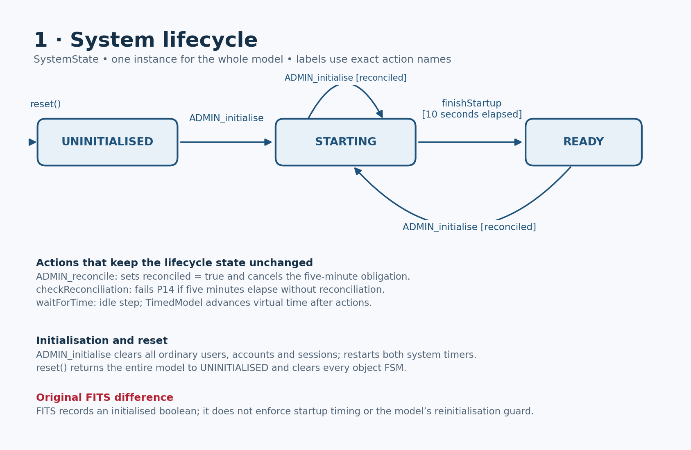
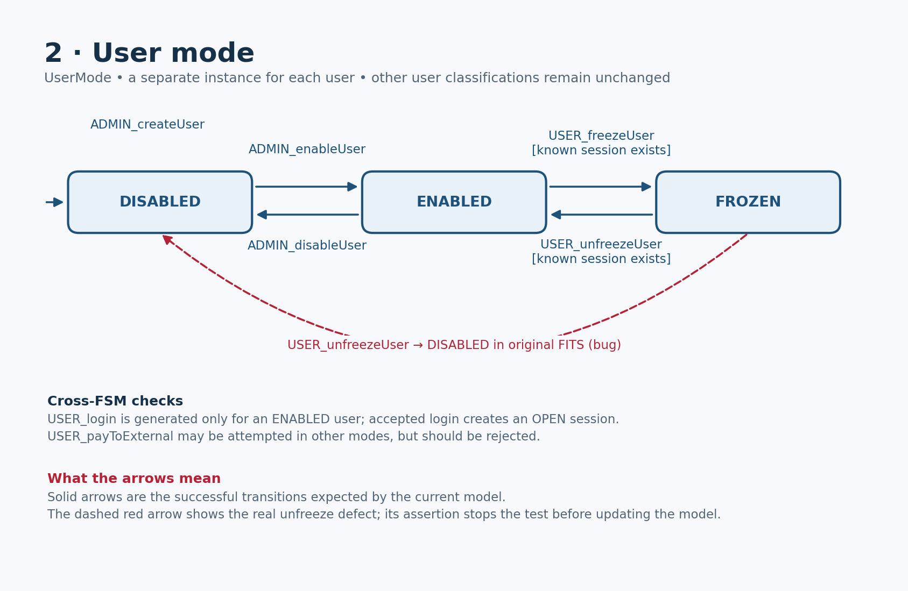
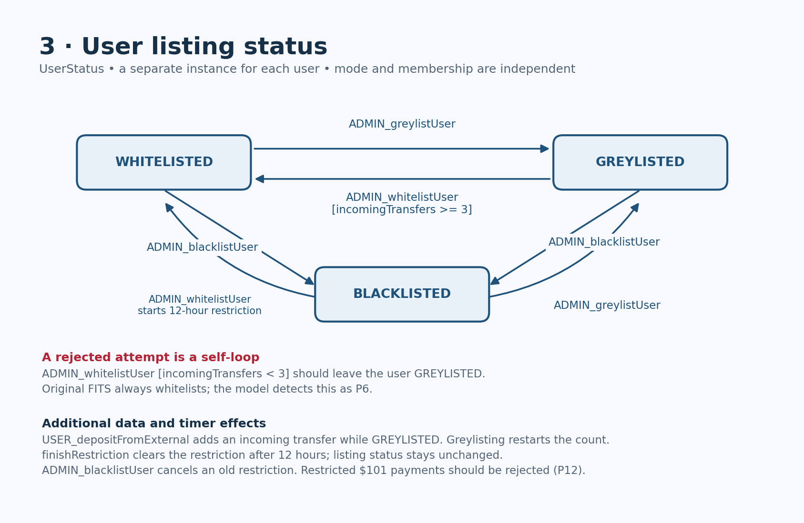
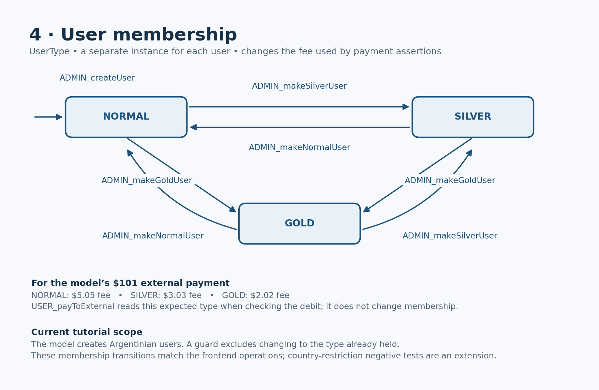
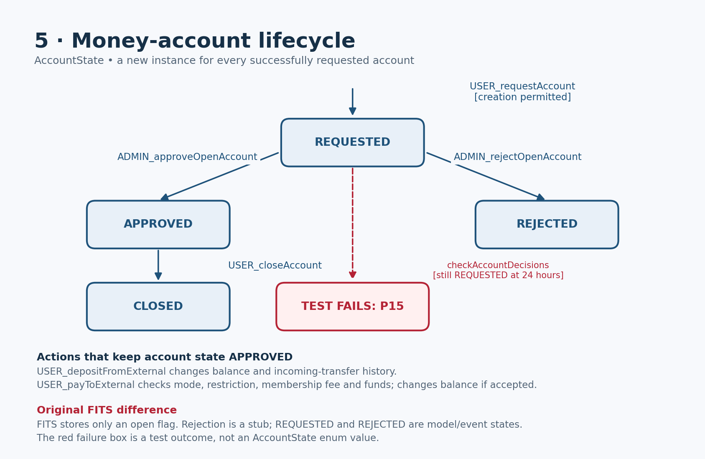
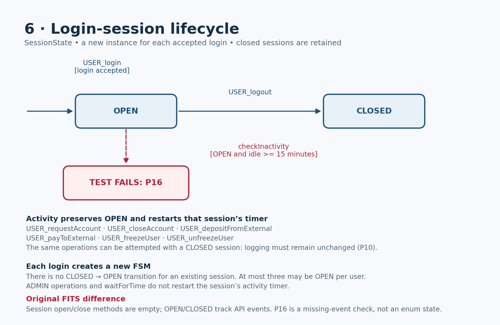

# FITS ModelJUnit tutorial

An in-memory banking example with one shared, timed FSM model and one JUnit runner.
All model code is in `src/test/java/fits/model/FitsModelTest.java`.

## What FITS does

An administrator creates and enables users, changes their classification, and
approves or rejects money accounts. Users log in, request accounts, deposit money,
pay bills, transfer money and log out. Membership determines payment fees.
`FrontEnd` is the Java API that a client interface could call. There is no database,
real banking network, graphical interface or application `main()`.

The implementation is copied from the book's chapter 10. Its defects and missing
policy checks are retained so students can discover counterexamples.

| Implementation file | Purpose |
|---|---|
| `TransactionSystem.java` | Creates and connects the frontend and backend. Construction does not initialise the administrator's system. |
| `FrontEnd.java` | Public administrator and user operations. Model actions call this API. |
| `BackEnd.java` | Stores users, allocates IDs and performs initialisation. Tests use getters to observe results. |
| `UserInfo.java` | One user's mode, listing status, membership, accounts, sessions and fee calculation. |
| `BankAccount.java` | Account number, owner, open flag and balance. |
| `UserSession.java` | Session owner, ID and operation log. Open/close methods are empty observation points. |

## Rules represented

| Rule | What the rule means | How the shared model checks it |
|---|---|---|
| **P2 — Initialise before login** | An enabled user must not be able to open a session before the transaction system has been initialised. Enabling the user alone is not sufficient. | `USER_login` allows the attempt but expects rejection while the system is `UNINITIALISED`. An accepted login at this point fails the assertion. |
| **P5 — No withdrawals while disabled** | After the administrator disables a user, the user must not withdraw money until enabled again. An existing session does not grant permission to continue withdrawing. | `USER_payToExternal` attempts a payment and expects rejection when the user's mode is not `ENABLED`, including `DISABLED` and `FROZEN`. The expected balance must remain unchanged. |
| **P6 — Three incoming transfers before whitelisting** | A greylisted user must receive at least three incoming transfers before being whitelisted. Entering `GREYLISTED` starts a new count for that user. | `USER_depositFromExternal` counts incoming deposits while greylisted. `ADMIN_whitelistUser` expects the status to remain `GREYLISTED` below three transfers, and permits `WHITELISTED` once the count reaches three. |
| **P7 — Ten account requests per session** | A user may request at most ten new money accounts through a particular session. The count belongs to the session, so a different session has its own allowance. | `USER_requestAccount` keeps a separate count for each session. After ten accepted requests, another attempt must return no account number and must not increase the real account count. |
| **P9 — Three concurrent sessions per user** | A user may have several sessions, but no more than three may be open simultaneously. Logging out frees a place; retaining a closed session record does not use that place. | `USER_login` counts that user's `OPEN` session FSMs and expects a fourth concurrent login to be rejected. `USER_logout` changes one session to `CLOSED`. |
| **P10 — Logging only in an active session** | Operations must not append entries to a session's log after that session has been closed. Knowing an old session ID does not make it active again. | User actions can select retained `CLOSED` sessions. `observeActivity` compares the real log before and after the operation and asserts that it has not changed. |
| **P11 — Ten-second startup period** | Even after initialisation, no session should open during the first ten seconds. Login becomes eligible once this startup period has completed. | `ADMIN_initialise` starts a ten-second timer. `USER_login` expects rejection while the system is `STARTING`; `finishStartup` moves it to `READY` when the deadline is reached. |
| **P12 — Twelve-hour transfer restriction** | When a blacklisted user is whitelisted, that user must not perform a single external transfer above $100 for the next twelve hours. The limit concerns the transfer amount, not its fee. | `ADMIN_whitelistUser` starts the restriction for that user. `USER_payToExternal` attempts $101 and expects rejection while restricted; `finishRestriction` clears the restriction at twelve hours. The example's $100 deposits do not exceed the limit. |
| **P13 — Three creations in a rolling day** | A user may have at most three money accounts created within any rolling 24-hour period. This is a moving window, rather than an allowance that resets at midnight. | `USER_requestAccount` checks that user's recent creation timestamps and expects another creation to be rejected once three are in the window. `expireCreations` removes timestamps aged 24 hours without deleting the account FSMs. |
| **P14 — Reconcile within five minutes** | An administrator must perform reconciliation within five minutes of initialisation. This checks an obligation on the generated administrator schedule. | `ADMIN_initialise` starts the deadline; `ADMIN_reconcile` records the event and cancels it. `checkReconciliation` fails if the event is missing at the deadline. The model also guards reinitialisation until reconciliation has occurred. |
| **P15 — Decide an account request within a day** | Each requested money account must be approved or rejected within 24 hours of its creation. Deciding one account does not discharge another account's obligation. | `ADMIN_approveOpenAccount` and `ADMIN_rejectOpenAccount` change that account's expected state. `checkAccountDecisions` fails if an account is still `REQUESTED` when its individual deadline is reached. |
| **P16 — Close an idle session within fifteen minutes** | Each session must be closed within fifteen minutes of inactivity. Activity in one session must not keep another session alive. | `observeActivity` updates only the selected open session's last-activity time. `USER_logout` records closure; `checkInactivity` fails if a session remains `OPEN` at its inactivity deadline. Administrator actions and `waitForTime` do not restart this timer. |

Additional untimed transitions cover enabling, disabling, freezing, unfreezing,
listing status and all three membership types. Fee expectations reflect membership.
The original unfreeze operation wrongly disables the user; its assertion expects
`ENABLED`.


## The model's FSMs

The model has its own enums, independent of the implementation. This lets an
assertion compare what FITS actually did with what it should have done.

| Enum | States | Scope |
|---|---|---|
| `SystemState` | `UNINITIALISED`, `STARTING`, `READY` | Whole system |
| `UserMode` | `DISABLED`, `ENABLED`, `FROZEN` | Each user |
| `UserStatus` | `WHITELISTED`, `GREYLISTED`, `BLACKLISTED` | Each user |
| `UserType` | `NORMAL`, `SILVER`, `GOLD` | Each user |
| `AccountState` | `REQUESTED`, `APPROVED`, `REJECTED`, `CLOSED` | Each money account |
| `SessionState` | `OPEN`, `CLOSED` | Each login session |

`ExpectedUser` is a small nested data holder in the same file. Each created user
gets a separate instance with all three user classifications, maps of account and
session states, balances, counters and timestamps. The `users` map retains these
instances by their real IDs. `user` identifies the currently selected instance;
`selectUser()` switches between users without changing FITS. Sessions and money
accounts stay in their maps after closing so forbidden operations can be tested.

For example, one user can simultaneously be `ENABLED`, `GREYLISTED` and `GOLD`,
have two `APPROVED` accounts, and have one `OPEN` and one `CLOSED` session.
These are independent FSMs composed into the shared model's state.

## FSM diagrams

These are diagrams of the **current test model's expected behaviour**, derived
from its enums, guards and actions. They are separate views of one composed
model, rather than six runners. Each user has independent copies of the three
user FSMs, and each account and session has its own lifecycle FSM.

Blue arrows show successful expected transitions and use exact action names.
Conditions in brackets explain when transitions can succeed. Red dashed arrows
show an original FITS defect or a test failure; a red failure box is not an enum
state. Data-only actions and important implementation differences are described
beneath each diagram. The diagrams omit most unchanged-state self-loops.

### System lifecycle



### User mode



### User listing status



### User membership



### Money accounts



### Login sessions



The **whole model state** combines these object states with balances, counters,
timestamps, reconciliation and transfer-restriction flags. For example,
`USER_depositFromExternal` leaves an account APPROVED and its session OPEN,
while changing its balance, the session's last-activity time and possibly the
user's incoming-transfer count. `selectUser` changes the selected user only.
`expireCreations` removes old timestamps from the rolling count without changing
account lifecycle states. `waitForTime` changes no enum and does not reset the
inactivity timer; the `TimedModel` wrapper advances time.

PNG diagrams are in `docs/fsm`. See
[diagram notes](docs/fsm/README.md) for scope and guard details.

## Reading the single test file

1. **Enums and fields** hold independent expected states and the additional data
   needed for limits, fees and timed obligations.
2. **`getState()`** returns a snapshot of the composed FSMs and relevant counters.
   Exact balances and timestamps remain model data rather than appearing in the
   state string. This is an FSM with additional data, not a complete graph of
   every possible balance and timestamp.
3. **`reset(boolean testing)`** clears the model and constructs a fresh
   `TransactionSystem` when testing is true. Model-only exploration avoids real
   API calls when testing is false.
4. **Guards and `@Action` methods** appear together. Business actions use the
   same names as their corresponding `FrontEnd` operations, supply example
   arguments, call that operation, assert its result, then update expected state.
   Setup constructs the system; business mutations go through `FrontEnd`.
   Backend and domain getters read results for assertions.
5. **Clock and timeout actions** implement the timed rules in the same model.
   `@Time now` is virtual milliseconds; `-1` disables an `@Timeout`.
   `waitForTime()` lets time progress without a business operation. No sleeps
   are needed. Deadline helpers find the earliest outstanding obligation across
   all users, accounts or sessions; changing the selected user does not lose timers.
6. **`runModelJUnit()`** is the only runner. It builds the ModelJUnit graph,
   reports whether graph exploration completed, then creates `TimedModel` and
   `GreedyTester`, sets seed 1 and generates up to 1,000 steps. The listener prints
   each transition as separate state, action and state lines. `StopOnFailureListener`
   stops at the first failed assertion. State, transition, action and transition-pair
   coverage are printed even when an assertion fails.

ModelJUnit selects among enabled actions, with `GreedyTester` favouring transitions
it has not explored. It can also randomly reset the model to begin another path.
There is no fixed action order or guarantee that every enabled action is tried.

A guard checks whether an **attempt** can be generated. For example, login needs
an existing enabled user, but the action still permits testing login before
initialisation, during startup or above the session limit. Those forbidden
attempts should be rejected by FITS and leave the expected FSM unchanged.
Filtering them all out in the guard would hide the missing policy checks.

## Running it

Use Java 25 and Maven 3.9 or later. Import `pom.xml` in IntelliJ with JDK 25 and
run the JUnit method `runModelJUnit()`, or use:

```sh
mvn clean verify
```

With `SKIP_KNOWN_VIOLATIONS` set to `false`, the test fails because FITS does
not conform. The failure is not caught or converted into a passing test. With
seed 1 the first counterexample is P6: a greylisted user is whitelisted before
three incoming transfers. Read the printed transitions leading to the failed
assertion. Fixing that defect or changing the seed can expose a different first
failure.

For an exploratory run that filters known failure-producing actions from the
model's guards, set `SKIP_KNOWN_VIOLATIONS` near the top of
`FitsModelTest.java` to `true`, then run `mvn test`.

This mode skips premature logins, early whitelisting, payments forbidden by the
mode or temporary restriction, operations on closed sessions, over-limit account
requests and unfreezing (FITS returns success but leaves the user disabled). It
also lets the reconciliation, account-decision and inactivity deadlines pass
without reporting their property failures. Other
assertion failures still stop the runner. Since these attempts or checks are
filtered or ignored, this mode does not check those violations; set the field back
to `false` to detect them.

To compile and package without executing the tutorial test:

```sh
mvn -DskipTests package
```

## Scope and interpretation

The graph and generated run explore up to two ordinary Argentinian users, four
allocated sessions per user (including a fourth login attempt), and eleven accounts
per user. The
built-in administrator is a setup fixture. Deposits use $100 and external payments
use $101. Own-account and inter-user transfers, arbitrary amounts, countries and
other API inputs are extension exercises. P1, P3, P4 and P8 are not separately
implemented as general property checks.

All listed checks share one model, but the first failure ends a run. Including a
check does not mean that the run reached it. The three-per-day limit can mask the
ten-per-session limit until enough virtual time has elapsed. Coverage describes
Coverage reports totals from the graph ModelJUnit discovers. The runner prints
whether graph exploration completed; `buildGraph()` has a 10,000-step limit and
reports unexplored branches if it reaches that limit. Transition-pair coverage
is counted over this graph.

Treat that denominator as coverage of the model's **abstract graph**, not every
concrete combination of FITS data. `getState()` deliberately omits exact balances,
clock values and deadline timestamps, even though some guards depend on them.
ModelJUnit can therefore merge states that have different enabled actions. The
composed FSMs can also create a large graph. A complete graph report means the
abstract graph was explored according to ModelJUnit's listener; it does not prove
that the state abstraction captures every concrete transition pair.

Account rejection and reconciliation are stubs. The model records their API events,
not completion of accounting work. Sessions have no active-state getter or automatic
scheduler; their expected OPEN/CLOSED states follow login/logout events. P14 and
P15 check obligations on the generated administrator schedule, while P16 checks
for an observed close event. These timeout failures alone do not demonstrate which
component should have supplied the missing event. A production implementation
would need observable completion and automatic expiry where required.

Forbidden login is expected to return `-1`; forbidden account creation is expected
to return `null` without creating an account. Those are tutorial rejection contracts
for APIs whose original implementation omits these checks. Exactly 24-hour-old
creations expire from the rolling window. A decision at its deadline is accepted
if its event occurs before the corresponding timeout check.