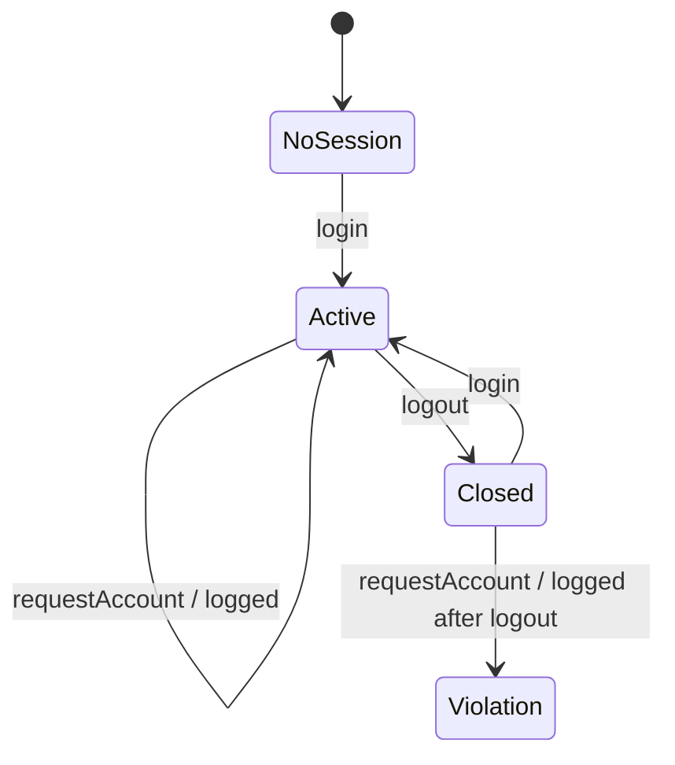

# A suggested ModelJUnit tutorial

Start with `mvn clean verify`. The default suite passes because it asserts both
legal behaviour and the presence of known counterexamples in this deliberately
buggy teaching system. Run `mvn -Pconformance test` to expose those counterexamples
as uncaught failures. Passing the default suite does not establish compliance.

## 1. Understand just enough FITS

A `TransactionSystem` owns a `FrontEnd` and a `BackEnd`. Administrators create and
enable users, change listing status, approve accounts and reconcile. Users log in,
request money accounts, deposit, pay and log out. A user has a mode (enabled,
disabled, frozen), a listing status, a membership type, accounts and sessions.

Use the returned IDs and account-number objects when calling the original code.
This implementation contains identity-comparison bugs as well as intentionally
missing policy checks. Those bugs are retained for verification exercises.

The tutorial models test one requirement at a time. They prepare a funded account
when needed so an unrelated insufficient-funds result cannot mask the property.
They do not use the original EGCL/AspectJ monitors as their oracle.

## 2. Begin with logging between login and logout (P10)

Read the P10 branches in `FitsFsmModel`, then run:

```sh
mvn -Dtest=FitsFsmTest test
```

P10 has three abstract states:



The key pattern for an `@Action` is:

1. Call the real system operation.
2. Update independent model state where the operation succeeds.
3. Assert that observed system behaviour agrees with the requirement.

`getState()` returns an immutable description of the abstract state. A guard named
`requestAccountGuard()` controls whether ModelJUnit can choose `requestAccount()`.
Guards represent the inputs a test path allows; they are not the system's security
policy. If every illegal input is hidden behind a false guard, a test cannot expose
an implementation that accepts illegal inputs. This example therefore has a safe
configuration and a counterexample/conformance configuration that permits the
forbidden action and asserts what happened.

FITS retains its session object after logout, and its `log()` method still appends.
The model can demonstrate P10 without inventing an open-state getter.

## 3. Explore richer untimed FSMs

| Rule | Model state | Counterexample |
|---|---|---|
| P2 | Not initialised / initialised, login status | Enabled user logs in before initialisation |
| P5 | Enabled / disabled, login status | Existing session pays after the administrator disables the user |
| P6 | Greylisted plus 0, 1, 2 or 3 incoming transfers | Whitelisting happens too soon |
| P7 | Request count 0–10, login status | Eleventh request in one session |
| P9 | Concurrent sessions 0–3 | Fourth concurrent login |
| P10 | No session / active / closed | A request logs to a closed session |

Counters are bounded or saturated once further values cannot affect the rule.
`getState()` projects onto the selected requirement, keeping the graph finite.
Session and user IDs are test data rather than model states. Otherwise each new
login or account would create a new vertex and the graph would never complete.

`FitsFsmTest` checks one minimal counterexample per rule and then generates legal
paths with a seeded `GreedyTester`. P7 adds explicit threshold paths because a
random walk may repeatedly log out before reaching ten requests.

Earlier source references: chapter 3 lists all requirements; chapter 7's
`properties.aut` models P2; chapter 8's `properties.re` includes P5 and P10;
chapter 9's `properties.ltl` expresses P2. P6, P7 and P9 are reconstructed from
the chapter 3 criteria and original FITS scenarios.

## 4. Add timing to the same ideas

Read `FitsTimedModel`, `Scenario` and `FitsFixture`, then run:

```sh
mvn -Dtest=Chapter10TimedTest test
```

Replace `FsmModel` with `TimedFsmModel`, add `@Time int now`, implement
`getNextTimeIncrement(Random)`, and wrap the instance in `TimedModel`.
An integer annotated `@Timeout("executeEvent")` gives the next scheduled action's
absolute virtual time. `TIMEOUT_DISABLED` disables it. Here 1 tick is 1 ms;
timeout probability 1 fast-forwards to each event without sleeping.

`Scenario` holds readable event plans, including boundary and isolation cases.
`chooseSafe`, `chooseBoundary` and `chooseViolation` are guarded alternative paths;
ModelJUnit chooses and traverses them. Catalog cases also receive deterministic
replay through the timed action API. This is a finite catalog model, not an
exhaustive exploration of every possible user operation at every possible time.

`FitsFixture` invokes actual frontend methods and keeps independent timestamps.
FITS has no internal clock. This example checks timestamped behaviour and missing
events at deadlines, using a test-only spy for session log/close calls. It does not
add policy enforcement or simulate a scheduler the implementation does not have.

Compare a login at 9,999 ms with a login at 10,000 ms, then examine the three
12-hour cases in P12 and the rolling 24-hour cases in P13. For deadline obligations,
examine `checkpoint()`: a missing action is observable even if the system makes no
further call. Equal-time events run in a declared order before a checkpoint.

## 5. Reset, repeat and inspect coverage

`reset(true)` creates a fresh system and oracle. `reset(false)` resets abstract
fields only and does not touch the system, because ModelJUnit uses it while
building the graph. `getState()` never changes merely because time advanced.

```sh
mvn -Dfits.seed=42 -Dfits.steps=5000 test
```

Inspect `target/modeljunit/P*/safe-coverage.txt` for action, state, transition and
transition-pair coverage. Open the adjacent DOT graph with Graphviz. The safe graph
omits forbidden paths; negative replay and strict generation exercise those paths
separately. Action coverage counts permanently disabled methods too, so its
percentage may be below 100% even when all reachable states/transitions are covered.
Coverage measures this abstraction, not full FITS code coverage or proof of correctness.

## 6. Exercises

* Add another P6 counterexample after exactly one or two incoming transfers.
* Modify the enabled/disabled implementation and see whether P5's counterexample
  disappears. Then replace the characterization expectation with a conformance assertion.
* Add P1 and P3 as simple state invariants, then explain why these differ from P10's
  history-dependent rule.
* Add P8 with bounded attempt-count and aggregate-amount abstractions. Count failed
  outgoing payment attempts too, as the book requires.
* Add a two-user untimed model to check that counters belong to the correct user.
* Give timed path selection more parameter variation while keeping states finite.
* Add the chapter's advanced pause/resume timer policies as new requirements rather
  than silently changing P12.

Keep negative tests explicit: a caught failure must be the intended property
violation, never an arbitrary exception or a guard that refused to execute.
